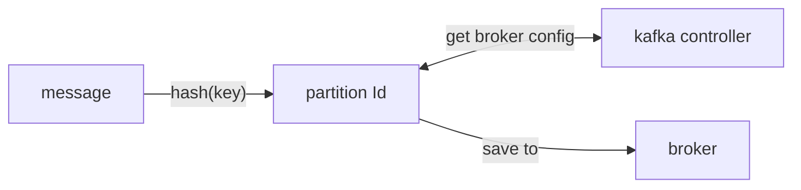

## Kafka record

an events contains:

1. `value`: `required`
2. `key`: used to determine partition
3. `timestamp`: order message
4. `headers`: store HTTP headers and metadata

## message store process

two-steps:

`Partition Determination`: message --hash(key)--> partition (preserve order at partition level)

`Broker Assignment`: find a broker holds that partition.

mapping of partitions to brokers is managed by `kafka cluster metadata` -- `kafka controller` (a role within broker cluster). Producer use metadata to send message to broker that hold target partition.



## partition

Each partition in Kafka functions essentially as an `append-only` log file. Messages are sequentially added to the end of this log, which is why Kafka is commonly described as a distributed commit log.

1. `Immutability`: can not be `altered` or `deleted`. avoids consistency issues, speeds up recovery processes
2. `Efficiency`: append at end --> minimizes disk seek times
3. `Scalability`: partition can be horizontal scaling.

offset in partition --> identify message position.

## leader-follower Replication

`leader`: handle all read and write, (leader assigned by cluster controller) --> distribute evenly across

`Follower Replication`: receive message from leader replica

`Synchronization and Consistency`: one of the follower replicas that has been fully synced can be quickly promoted to be the new leader, minimizing downtime and data loss.

`Controller's Role in Replication`: controller managed the `health` of all brokers and `leadership` & `dynamics` (based on `zookeeper`)

## Scaling - QPS per broker

Max disk write speed ≈ 1 GB/s
Message size = 10 KB
Max messages/sec ≈ 1 GB / 10 KB ≈ 102,400 messages/sec

A single broker on high-performance hardware can handle roughly 100k messages per second if each message is 10KB.

**scaling：**

1. add more brokers

2. partition strategy

### Hot partitions

1. `Random partitioning with no key`: even disribution, but lose the ability to guarantee order of messages

2. `Random salting`: We can add a random number or timestamp to the ad ID when generating the partition key.

3. `Use a compound key`: ID + Geo

4. `Back pressure`: slow down the producer

## Fault Tolerance and Durability

Setting `acks=all` ensures that the message is acknowledged only when all replicas have received it, guaranteeing maximum durability. 

`acks=1` by default

### what happens when a consumer goes down?

1. `Offset Management`: commit offsets after process a message

2. `Rebalancing`: When part of a consumer group, if one consumer goes down, Kafka will redistribute the partitions among the remaining consumers so that all partitions are still being processed.

## Handling Retries and Errors

### Producer Retries

`network issues`, `broker unavailability`, or `transient failures`

```java
import com.zhicheng.avro.User;
import org.apache.kafka.clients.producer.*;
import io.confluent.kafka.serializers.KafkaAvroSerializer;

import java.util.Properties;

public class AvroKafkaProducer {
    public static void main(String[] args) {
        Properties props = new Properties();
        props.put(ProducerConfig.BOOTSTRAP_SERVERS_CONFIG, "localhost:9092");

        // 使用 Confluent 的 Avro 序列化器
        props.put(ProducerConfig.KEY_SERIALIZER_CLASS_CONFIG, KafkaAvroSerializer.class.getName());
        props.put(ProducerConfig.VALUE_SERIALIZER_CLASS_CONFIG, KafkaAvroSerializer.class.getName());

        // Schema Registry 地址（必须）
        props.put("schema.registry.url", "http://localhost:8081");

        // 幂等性与重试配置
        props.put(ProducerConfig.ENABLE_IDEMPOTENCE_CONFIG, "true");
        props.put(ProducerConfig.RETRIES_CONFIG, 5);
        props.put(ProducerConfig.RETRY_BACKOFF_MS_CONFIG, 100);

        KafkaProducer<Object, Object> producer = new KafkaProducer<>(props);

        // 构造 Avro 对象
        User user = User.newBuilder()
                .setId("u123")
                .setName("Zhicheng")
                .setAge(30)
                .build();

        ProducerRecord<Object, Object> record = new ProducerRecord<>("user-topic", user.getId(), user);
        producer.send(record, (metadata, exception) -> {
            if (exception == null) {
                System.out.printf("Sent to topic %s partition %d offset %d%n",
                        metadata.topic(), metadata.partition(), metadata.offset());
            } else {
                exception.printStackTrace();
            }
        });

        producer.flush();
        producer.close();
    }
}

```

### Consumer Retries

One common pattern is to set up a custom topic that we can move failed messages to and then have a separate consumer that processes these messages.

If a given message is retried too many times, we can move it to a dead letter queue (DLQ). DLQs are just a place to store failed messages so that we can investigate them later.

## Performance Optimizations

`batch messages in the producer` before sending them to Kafka

```javaScript
const producer = kafka.producer({
  batch: {
    maxSize: 16384, // Maximum batch size in bytes
    maxTime: 100,   // Maximum time to wait before sending a batch
  }
});
```

`compressing the messages`: This can be done by setting the compression option in the producer configuration. Kafka supports several compression algorithms, including GZIP, Snappy, and LZ4

```javaScript
const producer = kafka.producer({
  compression: CompressionTypes.GZIP,
});
```

## Retention Policies

Kafka topics have a retention policy that determines how long messages are retained in the log. This is configured via the retention.ms and retention.bytes settings. The default retention policy is to keep messages for 7 days.